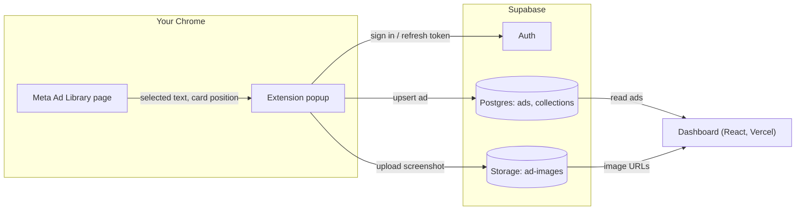

# AdScope — Competitor Ads Intelligence

A competitor ad research tool: a **Chrome extension** that clips ads from the Meta Ad Library, and a **React dashboard** for browsing, filtering and organising them. Both share one Supabase backend.

**Live demo:** https://competitor-ads-intelligence-theta.vercel.app

Select ad copy on Meta Ad Library → the extension fills in the ad ID, brand, headline, copy and a screenshot → save → the ad appears in the dashboard.

https://github.com/user-attachments/assets/faeee5d2-2e81-475f-852a-16934c026897

## Why this exists

Meta's official Ad Library API only returns commercial ads for the EU. For ads running in Taiwan (and the US), it returns political and social-issue ads only. So instead of an automated scraper, which would break Meta's terms, AdScope uses a **user-driven clipper**: you browse the public Ad Library as usual, and one click saves the ad you are looking at.

## Features

**Chrome extension (`extension/`)**
- Sign in with the same Supabase account as the dashboard; the session refreshes itself before it expires
- Select ad copy on the page → the extension finds the ad card around the selection and reads its Library ID
- Auto-fills the headline (first line of the copy) and the last brand you used
- Screenshots the ad card, crops and compresses it to WebP (~20 KB), and uploads it to Supabase Storage
- Saving an ad that already exists updates it instead of failing, without wiping fields you did not change

**Dashboard (`src/`)**
- Dashboard overview, Ads Explorer with search and platform / angle / saved filters, ad detail pages
- Competitors overview and Collections for grouping ads
- Manual import form for ads from other platforms

## Architecture



The extension and the dashboard never talk to each other directly. They only share the database, so either side can change without breaking the other.

## Technical decisions

| Decision | Why |
|---|---|
| **Plain JavaScript, no bundler, for the extension** | Keeps Manifest V3 concepts visible: the popup, `chrome.*` APIs and script injection. Supabase is called through its REST API with `fetch`, so the auth and storage requests are explicit HTTP calls rather than hidden inside `supabase-js`. |
| **`activeTab` + on-demand `scripting.executeScript`** | The extension only touches a page after you click it, and it does not ask for "read all websites" permission. |
| **Read the ad ID from the selected ad card, not the URL** | Ad Library is a single-page app: opening a different ad does not always update the URL. Walking up from the selected text to the card that contains "Library ID" ties the ID to the ad you actually chose. The URL is only a fallback. |
| **Screenshot the card instead of saving Facebook's image URL** | Facebook CDN image URLs are signed and expire. A screenshot also works for video ads (it captures the current frame). Images are resized to at most 800 px wide and saved as WebP, about 20 KB each, so the 1 GB free tier holds tens of thousands. |
| **Upload the image before writing the ad row** | If the database write fails, the only leftover is an unused image, which is overwritten next time. The other order could leave an ad pointing at a missing image. |
| **Refresh the session before it expires** | Access tokens last an hour. Before each save the extension checks `expires_at` and swaps the refresh token for a new session if fewer than 60 seconds remain. |
| **Upsert with a partial payload** | Saving an existing ad updates it. Fields the extension has no new value for (such as `image_url` when you did not re-capture) are left out of the request, so they are not overwritten with `null`. |

## Getting started

### 1. Supabase

You need a Supabase project with:

- An `ads` table with these columns: `id` (primary key, e.g. `meta-<library id>`), `competitor`, `platform`, `headline`, `copy`, `image_url`, `angle`, `started_at`, `source_id`, `source_url`, `is_real`
- `collections` and `collection_ads` tables for the Collections page
- Row Level Security on `ads`: anyone can read; signed-in users can insert and update
- A **public** Storage bucket named `ad-images` (1 MB limit, `image/webp` only), with a policy that lets signed-in users insert and update objects
- A user created under **Authentication → Users**

### 2. Dashboard

```bash
npm install
cp .env.example .env.local   # then fill in your values
npm run dev
```

Both values are in the Supabase dashboard under **Project Settings → API Keys**.

### 3. Chrome extension

1. Copy `extension/config.example.js` to `extension/config.js` and fill in the same two values
2. Open `chrome://extensions`, turn on **Developer mode**, click **Load unpacked**, and choose the `extension` folder
3. Pin **Ad Intel Clipper**, open an ad in the [Meta Ad Library](https://www.facebook.com/ads/library/), select its copy and click the extension

The publishable key is designed to be used in client code; access to data is enforced by Row Level Security.

## Known limitations and next steps

- **Depends on Ad Library's page text.** The ad ID is found by matching the "Library ID" / 「資料庫編號」 label. If Meta changes that wording, the regex needs updating.
- **Single-user permissions.** Any signed-in user can update any ad. A multi-user version would add a `user_id` column and limit updates to the owner.
- **Brand auto-detection** currently remembers the last brand you used rather than reading it from the page, because Facebook's markup uses generated class names that change often.
- **Not on the Chrome Web Store yet**; it is installed as an unpacked extension.
- Some dashboard pages still fall back to sample data in `src/data/`, which can be removed once there are enough real ads.

## Tech stack

React 19 · Vite · React Router · Tailwind CSS · Supabase (Auth, Postgres, Storage) · Chrome Extension Manifest V3 · Vercel
